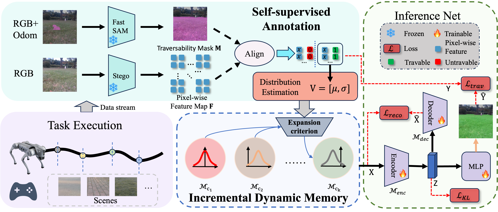

<div align="center">

<h1>IMOST: Incremental Memory Mechanism with Online Self-Supervision for Continual Traversability Learning</h1>

<div>
    <a target='_blank'>Kehui Ma</a>&emsp;
    <a target='_blank'>Zhen Sun</a>&emsp;
    <a target='_blank'>Chaoran Xiong</a>&emsp;
    <a target='_blank'>Qiumin Zhu</a>&emsp;
    <a target='_blank'>Kewei Wang</a>&emsp;
    <a href='https://scholar.google.com.hk/citations?user=Vm7d2EkAAAAJ&hl=zh-CN&oi=ao' target='_blank'>Ling Pei<sup>*</sup></a>&emsp;
</div>
<div>
    Shanghai Jiao Tong University
</div>

<div>
    <sup>*</sup>Corresponding author
</div>

<!-- <h4 align="center">
  <a href="https://www.youtube.com/watch?v=88_CyBNtEe8&t=168s" target='_blank'>[Demo]</a> •
  <a href="https://arxiv.org/abs/2312.02196" target='_blank'>[arXiv]</a>
</h4> -->

</div>

<!-- This is the pytorch implementation of our paper IMOST at ICRA 2025. -->


## Environment Setup
Todo
### Only for Test
Todo
<!-- We tested our code on Windows with `Python 3.8.15`, `Pytorch 1.10.2` with `cuda11.1`, other dependencies are specified in `requirements.txt`.

```python
conda create -n dynaip python==3.8.15
conda activate dynaip
pip install torch==1.10.2+cu111 torchvision==0.11.3+cu111 torchaudio==0.10.2 -f https://download.pytorch.org/whl/cu111/torch_stable.html
pip install -r requirements.txt
``` -->

### Complete version
Todo


## Citation

If you find this project helpful, please consider citing us:

```
@article{ma2024imost,
  doi = {10.13140/RG.2.2.33195.86560},
  url = {https://rgdoi.net/10.13140/RG.2.2.33195.86560},
  author = {{Kehui Ma} and Sun, Zhen and {Chaoran Xiong} and {Qiumin Zhu} and {Kewei Wang} and Pei, Ling},
  language = {en},
  title = {IMOST: Incremental Memory Mechanism with Online Self-Supervision for Continual Traversability Learning},
  publisher = {Unpublished},
  year = {2024}
}
```